## Der Aufbau

Du schaust sie gerade an. Diese Seite ist die Fallstudie, und jede Behauptung hier unten lässt sich durch Scrollen überprüfen.

sebastian-heitmann.dev ist die Visitenkarte meiner Beratungspraxis und muss zurückhaltend bleiben. Das Portfolio brauchte eine andere Bühne: einen Ort, an dem die Arbeit auftritt, statt beschrieben zu werden. Diese Trennung ist die Gründungsentscheidung. Die Domain `.rocks` ist kein Witz, sie ist das Briefing.

## Das Ergebnis

Ein Portfolio, das zeigt statt behauptet. Jede Technik hier unten ist auf der Seite live, die du gerade liest: Klapp eine Hülle auf, dreh einen Button, schalte den Monitor aus. Die Seite ist der Arbeitsnachweis, und wenn die Art, wie sie gebaut ist, dich anspricht, ist das der Pitch, bereits geliefert.

## Was gebaut wurde

- Eine zweisprachige (Englisch/Deutsch) Portfolio-Seite, statisch gebaut mit Astro 7. Es wird kein Client-Framework ausgeliefert; die Interaktivität sind ein paar Kilobyte reines TypeScript.
- Eine Konzertplakat-Bildsprache auf meinem Schweizer Designsystem: Anton als Display-Schrift, Duotone-Fotografie, gerissene Papierkanten, ein Betonuntergrund, fotografiert von echtem Beton.
- Die Setlist: Fallstudien und Side Projects als 3D-CD-Hüllen, die sich aufklappen, mit Tracklist und Link auf der Rückseite der Hülle.
- Der Presseteil: Anreißer meiner Essays als gestanzte Eintrittskarten mit Abriss, Perforation und ausgeklinkten Ecken, gestanzt aus gebürstetem Metall. Die Texte selbst leben auf sebastian-heitmann.dev; die Tickets sind die Tourplakate.
- Magnetische Bedienelemente: Jeder Button und jeder Link ist ein schwebendes Metallobjekt mit Druck-, Kipp- und Dreh-Physik und einer Federrückstellung.
- Der Über-mich-Bereich: ein raygetraceter CRT-Monitor, der meine Kurzbiografie als Terminal-Ausgabe zeigt, mit funktionierendem Einschaltknopf.
- Helles und dunkles Theme, Rücksicht auf reduzierte Bewegung und durchgängige Fallbacks ohne JavaScript.
- Eine eigene, vollständig terraformte Scaleway-Plattform: Storage, CDN und DNS, nach demselben Muster wie der .dev-Stack.

## Das System verbiegen

Die Seite läuft auf demselben Designsystem wie `.dev`, einem präzisen Schweizer Vokabular aus Tokens, Typografie und Abständen. Statt ein zweites System zu bauen, habe ich das vorhandene verbogen: dieselben Tokens, dieselben Komponenten darunter, aber ins Konzertplakat gedrückt. Anton-Kopfzeile, gerissene Papierkanten, Duotone-Fotografie, ein Betonhintergrund aus echtem Beton. Die Arbeitsregel für jede Seite: Die Bilder erzählen die Geschichte, der Text bleibt leise.

Die ordnende Metapher ist eine Show. Fallstudien sind eine Setlist; die Kacheln sind CD-Hüllen, die sich auf eine Tracklist-Rückseite drehen, und der Link sitzt auf der Rückseite der Hülle, dort wo bei einer echten CD das Inhaltsverzeichnis steht. Blog-Anreißer sind Eintrittskarten, gestanzt mit Abriss, Perforationslinie und ausgeklinkten Ecken. Die Ausschnitte sind echt: Maskenebenen stanzen Löcher durch die Karte, sodass der Beton durchscheint, wie bei gestanztem Papier.

## Objekte statt Elemente

Die Interaktionssprache behandelt UI als physische Objekte. Buttons und Links sind gebürstetes Metall, und jedes Stück ist aus einer anderen Region derselben fotografierten Stahlplatte geschnitten, weil identische Maserung eine Textur als Textur entlarvt. Sie schweben wie Magnete: Hovern übt Druck auf die Kante unter dem Cursor aus und kippt sie, ein Klick drückt das Stück in seine Tiefe hinein, statt es flach zu quetschen, und im Griff lässt es sich fassen, drehen und gegen seine Feder ziehen. Loslassen, und es schwingt in einer gedämpften Schwingung zurück, überschwingt einmal und legt sich hin, denn echte Objekte kennen kein Ease-out.

Nichts davon liefert ein Framework aus. Die Physik sind ein paar simple Event-Handler, die CSS-Custom-Properties schreiben; das Glätten übernimmt die Transition-Engine des Browsers. Die Seite sendet überhaupt kein React an den Client.

## Der Monitor, der sich nicht fälschen ließ

Der Über-mich-Bereich wollte ein 90er-Terminal: meine Biografie als `cat about.txt` auf einem CRT. Daraus wurde der härteste Kampf auf der Seite und die beste Geschichte.

Jeder Standardtrick scheiterte der Reihe nach. CSS-3D-Transformationen ergaben Wände, die sich an den Ecken lösten. Den Korpus in gestapelte DOM-Ebenen zu schneiden funktionierte optisch, verschmutzte das Markup aber mit Dutzenden bedeutungsloser Divs. Auf ein Canvas gemalt entstanden Verläufe, die Geometrie vortäuschten: Lüftungsschlitze, die sich krümmten, wo es keine Krümmung gab, ein Gehäuse ohne glaubhafte Tiefe. Das Urteil nach jedem Versuch war dieselbe Frage: Sieht das für dich nach einem 3D-Modell aus? Tat es nicht, weil es keines war.

Also wurde es eines. Ein Skript zur Build-Zeit raymarcht ein echtes 3D-Modell des Monitors, definiert über Signed Distance Fields: ein Korpus, der tiefer ist als breit, Kühlschlitze, die als echte Geometrie aus der Flanke subtrahiert sind, eine versenkte Einschaltbuchse, Beleuchtung pro Pixel aus einem Hauptlicht. Das Rendering wird als PNG gebacken; der Browser zahlt nie dafür. Das laufende Terminal ist echtes DOM, per Homografie in das gerenderte Glas gesetzt, sodass der Text innerhalb eines raygetraceten Objekts markierbar und zugänglich bleibt. Der Einschaltknopf funktioniert: Ein Klick lässt das Bild zu einem hellen Strich zusammenfallen, so wie Röhren starben, und die einrastende Kappe wechselt zwischen zwei raygetraceten Sprites, eingedrückt im Betrieb, herausstehend im Aus.

Fünf Ansätze landeten im Müll, bevor der sechste funktionierte. Das ist keine verlorene Zeit, sondern die Art, die Grenze eines Mediums zu finden: Jeder Fehlschlag hat das Problem enger gefasst, bis die verbleibende Antwort offensichtlich war.

## Deep Dive: die Maschinerie

Der Browser berechnet kein 3D; das Terminal bleibt echtes, markierbares DOM. Der Raymarcher ist ein schlichtes Bun-Skript, ohne Engine und ohne Abhängigkeiten außer einem Bild-Encoder. Der Monitorkorpus ist ein 2D-Profil aus einem abgerundeten Rechteck, durch die Tiefe geloftet mit einer Kurve, die erst ausbaucht und dann zuläuft, gemarcht mit Supersampling, schattiert mit einem Blinn-artigen Hauptlicht und automatisch gerahmt, indem vor dem Rendern die Extrempunkte projiziert werden. Er gibt außerdem Metadaten aus: Die in den Bildschirmraum projizierten Glasecken werden als normalisierte Koordinaten ausgeliefert, aus denen die Seite zur Laufzeit eine CSS-`matrix3d`-Homografie macht. Eine Kamera rendert die Pixel und platziert das DOM.

Das Magnetsystem setzt jedes Bedienelement aus zwei Ebenen zusammen: einem Mover, der sich zum Zeiger verschiebt, und einem Tilter, der sich darunter dreht, sodass Position und Rotation unabhängig federn. Die Rückstellungen sind CSS-`linear()`-Kurven, deren Fortschritt bewusst über 1.0 hinausgeht. Das Greifen läuft über Pointer Capture, mit Klickunterdrückung nach echtem Ziehen, damit das Drehen eines Objekts nie versehentlich navigiert.

Die CD-Hüllen und Tickets sind reine CSS-Objekte: mehrschichtige Masken mit explizitem Compositing für die Stanzungen, Schlagschatten, die der Silhouette folgen, und ein Fallback ohne JavaScript, das jede Karte auf Touch-Geräten navigierbar hält, noch bevor irgendein Skript geladen ist.

Die Plattform darunter ist dasselbe terraformte Scaleway-Muster wie bei sebastian-heitmann.dev, mit eigenem Bucket, eigener CDN-Pipeline und eigener DNS-Zone. Diese Geschichte erzählt die .dev-Fallstudie.
