## The setup

sebastian-heitmann.dev is the home of my consulting practice: a bilingual (English and German) site built with Astro in a precision-Swiss design system, carrying the landing page, the service offerings, and my writing. The site is deliberately composed on the surface. The case is everything underneath it.

A site that advertises engineering judgment should be able to survive an audit of its own foundations. So the constraint I set was simple: every part of the platform is code, nothing sensitive ever exists on disk, and a clean machine gets from `git clone` to a running production stack with three commands. No console clicking, no snowflake state, no "I set that up once and forgot how."

## The goals

- **A digital business card.** One canonical, always-current place that says who I am, what I do, and how to reach me.
- **Searchable beyond social media.** Clients should find me through search, not only through feeds. SEO is a first-class goal, not an afterthought.
- **Independent of social media.** Owned domain, owned content, owned audience. No platform's algorithm or terms of service between me and the people I work with.
- **EU sovereignty and privacy.** Hosted with a European provider, data staying in the EU, and a site that respects visitors instead of tracking them.

## The outcome

A platform that rebuilds from nothing in three commands, deploys in one, costs approximately nothing to run, and survived a live DNS migration with zero mail downtime. The site on top is the least interesting part, which is exactly the point.

And one front is still open: SEO. The technical work is done, but search visibility does not deploy; it validates on the search engines' clock, in weeks. That story continues below.

## What was built

- A bilingual (English/German) site with locale routing, hreflang alternates, and a one-time first-visit language redirect.
- A growing blog: essays on software, AI adoption, and running a practice, published as a bilingual content collection with German translations following the English originals.
- Dedicated landing pages for the three service lines (web development, technical project management, AI process automation) and a CV page.
- A contact form backed by a serverless function that sends through Scaleway Transactional Email from a verified sender domain.
- A light/dark/system theme with a three-state toggle.
- The full cloud platform as Terraform: object storage with CDN in front, the complete DNS zone including live Microsoft 365 mail records, the transactional-email domain, two serverless functions, and project-scoped IAM.
- A secrets pipeline (varlock schemas resolving from Proton Pass) and two idempotent deploy scripts, so any machine with vault access can build and ship.

## The calls that shaped it

**Static first, islands last.** The site ships almost no JavaScript. Astro renders everything at build time; React exists only as a build-time templating layer. The one real backend need, the contact form, became a Scaleway serverless function that talks to the Transactional Email API. With no server to keep running, the platform at rest costs the domain plus a rounding error: storage measured in megabytes, a CDN on a flat plan, and functions that bill per invocation inside the free tier.

**EU hosting, one provider.** Scaleway hosts everything: Object Storage for the static files, Edge Services as CDN, Serverless Functions for the form and the apex redirect, Domains and DNS for the zone, Transactional Email for delivery. One Terraform provider, one bill, EU data residency by default.

**Secrets that never touch disk.** Config is described by a committed varlock schema per workspace; sensitive values resolve at runtime from Proton Pass through a CLI session. There is no `.env` to leak, no credentials file to rotate after a laptop dies. Terraform even generates the mail function's API key itself, so that secret exists only inside the state and the function's environment.

## What broke in soundcheck

The honest part of any platform story is where it fought back.

**Moving DNS under a live mailbox.** The zone had to move from GoDaddy's nameservers to Scaleway's without dropping the Microsoft 365 mail that runs on the same domain. Registration stayed put; only hosting moved. The cutover ran on a written, reversible runbook: reproduce every record in Terraform first, verify against a live diff, then swap nameservers and watch TTLs, with the old zone intact as the rollback path. Mail never blinked.

**The apex problem.** Edge Services cannot serve a bare apex domain, and DNS forbids a CNAME there. The fix is a tiny serverless function that owns the apex's TLS certificate and 301-redirects everything to `www`, preserving path and query. Serverless cold starts would make that redirect sluggish, so a free-tier cron pings it every five minutes to keep it warm. Total cost: zero.

**The CDN that would not purge.** Cache invalidation earned its reputation here: purge requests reported success while stale files kept serving. Instead of fighting the CDN, the deploy pipeline makes purging irrelevant. Every asset ships under a content-hashed filename with an immutable one-year cache policy, and HTML is `no-cache`, revalidated by ETag on every request. Deploys are visible immediately and nothing can ever be stale, purge or no purge.

**The search engines, ongoing.** The still-open front is SEO. A bilingual site multiplies the ways indexing can go quietly wrong, and mine did: hreflang and canonical tags that looked plausible but kept pages out of the index. The fixes and checks are in place; what remains is the part no engineer can accelerate. Search engines validate changes on their own clock, re-crawling and re-scoring over weeks, and the only honest move is the one the rest of the platform runs on: fix the mechanism, then verify against data as it arrives in Search Console, not against hope.

## Deep dive: the platform

The Terraform graph manages the Scaleway project itself plus everything in it: the storage bucket with website hosting, the Edge Services pipeline (plan, DNS stage, cache stage, backend stage), the full DNS zone including the Microsoft 365 records, the transactional-email sender domain with its DKIM records, both serverless functions, and a project-scoped IAM key generated for the mail function at apply time.

State lives in a Scaleway Object Storage bucket using S3-native locking, no DynamoDB substitute needed. Scaleway's S3 API has a sharp edge worth knowing: targeting a non-default project requires authenticating as `ACCESS_KEY@PROJECT_ID`, which is documented nowhere prominent and cost an afternoon.

The deploy scripts are two idempotent Bun/bash entry points: one applies infrastructure, one builds and syncs the site. The sync sets per-object cache headers at upload time, prunes orphaned multi-megabyte source images that Astro's image pipeline would otherwise leak into the bundle, and aborts if the built HTML references a function endpoint that disagrees with Terraform's output. The build is byte-identical across machines, which turns "did the deploy change anything" into a checksum question.

## Related

- [sebastian-heitmann.rocks](/cases/rocks-portfolio/): the portfolio site, built on this same platform pattern, where the design gets loud.
- [--v8-asterisk](/cases/v8-asterisk/): the design system both sites run on, shipped as a shadcn registry. The .rocks site bends it into its punk variant, v8-wildcard.
